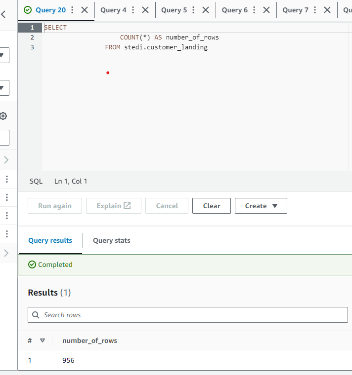
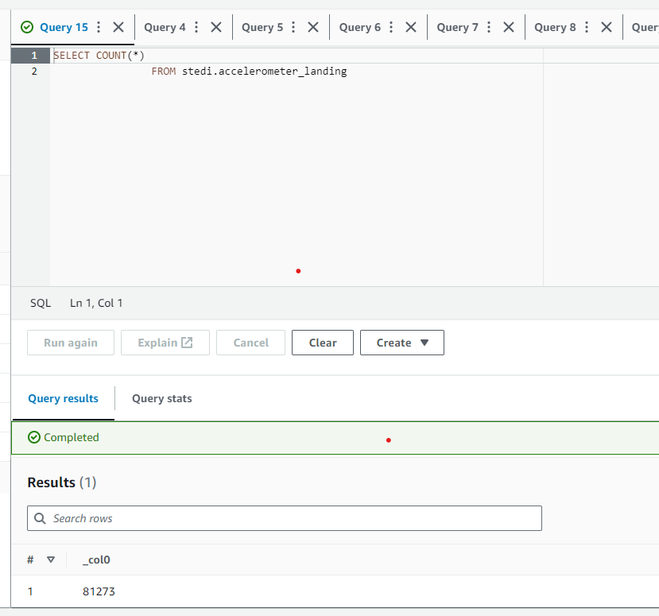
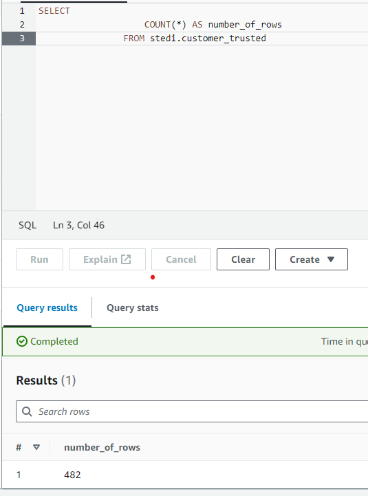

# Project: STEDI Human Balance Analytics

## Project Overview

### Spark and Human Balance

As you have learned in this course Spark and AWS Glue allow you to process data from multiple sources, categorize the data, and curate it to be queried in the future for multiple purposes. In this project you will directly use the skills you have used, including some of the code you have already written.

You will go beyond that to write additional AWS Glue jobs to create curated step trainer data that can be used for machine learning.

### Project Introduction: STEDI Human Balance Analytics

In this project, you'll act as a data engineer for the STEDI team to build a data lakehouse solution for sensor data that trains a machine learning model.

### Project Details

The STEDI Team has been hard at work developing a hardware STEDI Step Trainer that:

trains the user to do a STEDI balance exercise;
and has sensors on the device that collect data to train a machine-learning algorithm to detect steps;
has a companion mobile app that collects customer data and interacts with the device sensors.
STEDI has heard from millions of early adopters who are willing to purchase the STEDI Step Trainers and use them.

Several customers have already received their Step Trainers, installed the mobile application, and begun using them together to test their balance. The Step Trainer is just a motion sensor that records the distance of the object detected. The app uses a mobile phone accelerometer to detect motion in the X, Y, and Z directions.

The STEDI team wants to use the motion sensor data to train a machine learning model to detect steps accurately in real-time. Privacy will be a primary consideration in deciding what data can be used.

Some of the early adopters have agreed to share their data for research purposes. Only these customers’ Step Trainer and accelerometer data should be used in the training data for the machine learning model.

## Project Data

STEDI has three JSON data sources to use from the Step Trainer. You can download the data from here or you can extract it from their respective public S3 bucket locations:

### 1. Customer Records (from fulfillment and the STEDI website):

AWS S3 Bucket URI - s3://cd0030bucket/customers/

contains the following fields:

- serialnumber
- sharewithpublicasofdate
- birthday
- registrationdate
- sharewithresearchasofdate
- customername
- email
- lastupdatedate
- phone
- sharewithfriendsasofdate

### 2. Step Trainer Records (data from the motion sensor):

AWS S3 Bucket URI - s3://cd0030bucket/step_trainer/

contains the following fields:

- sensorReadingTime
- serialNumber
- distanceFromObject

### 3. Accelerometer Records (from the mobile app):

AWS S3 Bucket URI - s3://cd0030bucket/accelerometer/

contains the following fields:

- timeStamp
- serialNumber
- x
- y
- z

## Project Instructions

### Project Instructions

Using AWS Glue, AWS S3, Python, and Spark, create or generate Python scripts to build a lakehouse solution in AWS that satisfies these requirements from the STEDI data scientists.

### Requirements

To simulate the data coming from the various sources, you will need to create your own S3 directories for customer_landing, step_trainer_landing, and accelerometer_landing zones, and copy the data there as a starting point.

- You have decided you want to get a feel for the data you are dealing with in a semi-structured format, so you decide to create two Glue tables for the two landing zones. Share your customer_landing.sql and your accelerometer_landing.sql script in git.
- Query those tables using Athena, and take a screenshot of each one showing the resulting data. Name the screenshots customer_landing(.png,.jpeg, etc.) and accelerometer_landing(.png,.jpeg, etc.).

Customer Landing


Accelerometer Landing


The Data Science team has done some preliminary data analysis and determined that the Accelerometer Records each match one of the Customer Records. They would like you to create 2 AWS Glue Jobs that do the following:

1. Sanitize the Customer data from the Website (Landing Zone) and only store the Customer Records who agreed to share their data for research purposes (Trusted Zone) - creating a Glue Table called customer_trusted.

2. Sanitize the Accelerometer data from the Mobile App (Landing Zone) - and only store Accelerometer Readings from customers who agreed to share their data for research purposes (Trusted Zone) - creating a Glue Table called accelerometer_trusted.

3. You need to verify your Glue job is successful and only contains Customer Records from people who agreed to share their data. Query your Glue customer_trusted table with Athena and take a screenshot of the data. Name the screenshot customer_trusted(.png,.jpeg, etc.).


Customer Trusted


Data Scientists have discovered a data quality issue with the Customer Data. The serial number should be a unique identifier for the STEDI Step Trainer they purchased. However, there was a defect in the fulfillment website, and it used the same 30 serial numbers over and over again for millions of customers! Most customers have not received their Step Trainers yet, but those who have, are submitting Step Trainer data over the IoT network (Landing Zone). The data from the Step Trainer Records has the correct serial numbers.

The problem is that because of this serial number bug in the fulfillment data (Landing Zone), we don’t know which customer the Step Trainer Records data belongs to.

## How to run

### Clone the project

```
git clone https://github.com/vananh0905/AWS-pj3-stedi.git
```

### Install package

Should be create a virtual environment (venv), activate it

```
$ conda create -n aws python=3.9
$ conda activate aws
```

```
$ pip3 install boto3
$ pip3 install pandas
$ pip3 install awscli
```

Open stedi.ipynb: <a href="https://github.com/vananh0905/AWS-pj3-stedi/blob/master/stedi.ipynb">NoteBook</a>

Run code follow by markdown


Using SQL Scripts: <a href="https://github.com/vananh0905/AWS-pj3-stedi/tree/master/sql_script">SQL Scripts</a>
